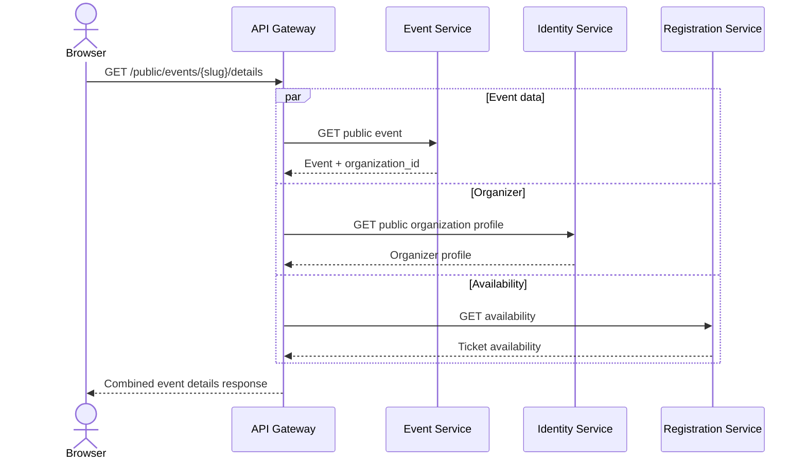

# Gateway API Composition

```mermaid
sequenceDiagram
  actor Browser
  participant GW as API Gateway
  participant EV as Event Service
  participant ID as Identity Service
  participant REG as Registration Service
  Browser->>GW: GET /public/events/{slug}/details
  par Event data
    GW->>EV: GET public event
    EV-->>GW: Event + organization_id
  and Organizer
    GW->>ID: GET public organization profile
    ID-->>GW: Organizer profile
  and Availability
    GW->>REG: GET availability
    REG-->>GW: Ticket availability
  end
  GW-->>Browser: Combined event details response
```
