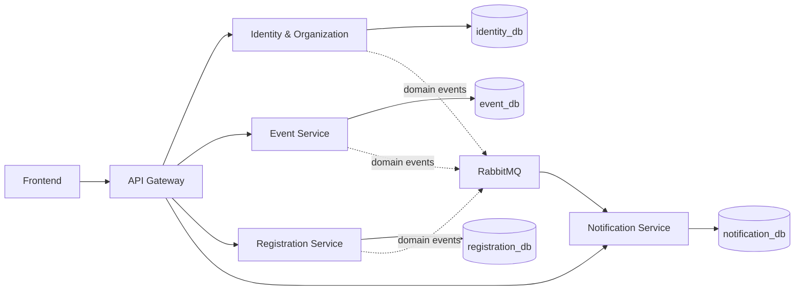

# Context và service boundaries

```mermaid
flowchart LR
  UI[Frontend] --> GW[API Gateway]
  GW --> ID[Identity & Organization]
  GW --> EV[Event Service]
  GW --> RG[Registration Service]
  GW --> NT[Notification Service]
  ID --> IDDB[(identity_db)]
  EV --> EVDB[(event_db)]
  RG --> RGDB[(registration_db)]
  NT --> NTDB[(notification_db)]
  ID -. domain events .-> MQ[RabbitMQ]
  EV -. domain events .-> MQ
  RG -. domain events .-> MQ
  MQ --> NT
```

Mỗi service chỉ ghi database riêng; các ID giữa service là tham chiếu logic.
