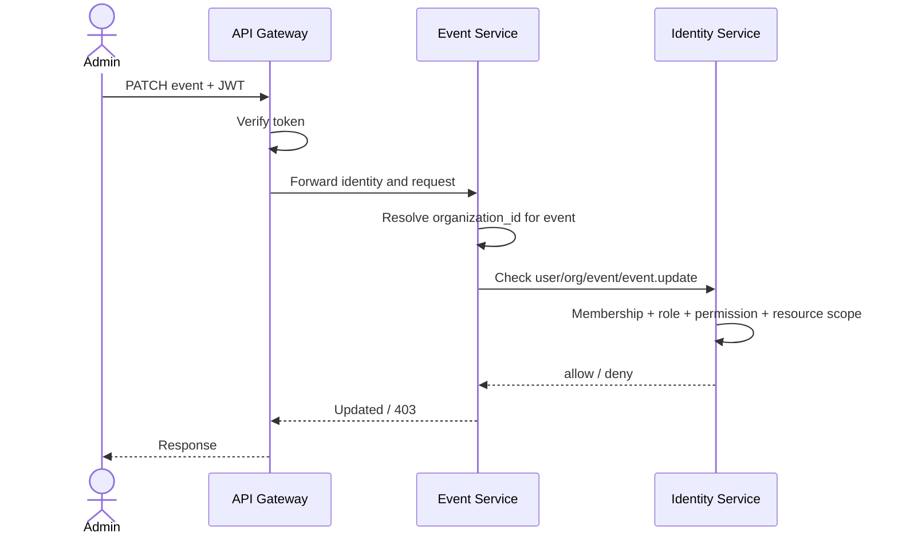

# Luồng Complex RBAC

```mermaid
sequenceDiagram
  actor Admin
  participant GW as API Gateway
  participant EV as Event Service
  participant ID as Identity Service
  Admin->>GW: PATCH event + JWT
  GW->>GW: Verify token
  GW->>EV: Forward identity and request
  EV->>EV: Resolve organization_id for event
  EV->>ID: Check user/org/event/event.update
  ID->>ID: Membership + role + permission + resource scope
  ID-->>EV: allow / deny
  EV-->>GW: Updated / 403
  GW-->>Admin: Response
```

